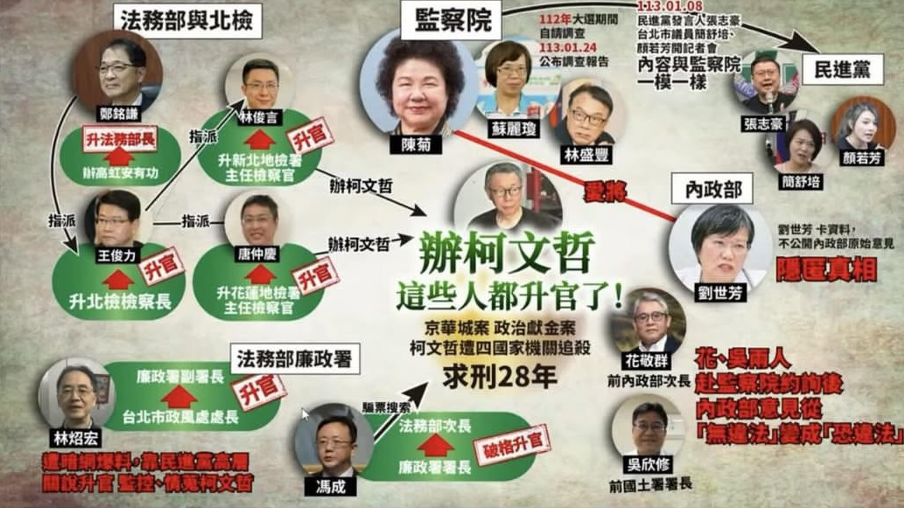
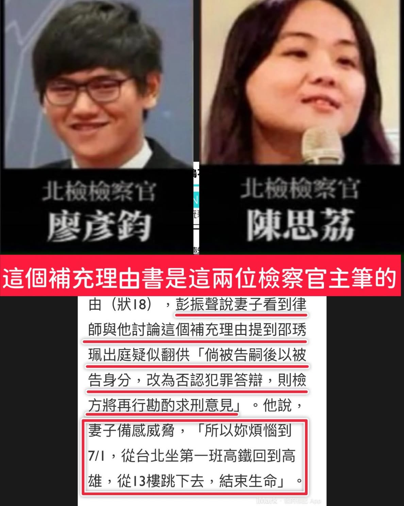
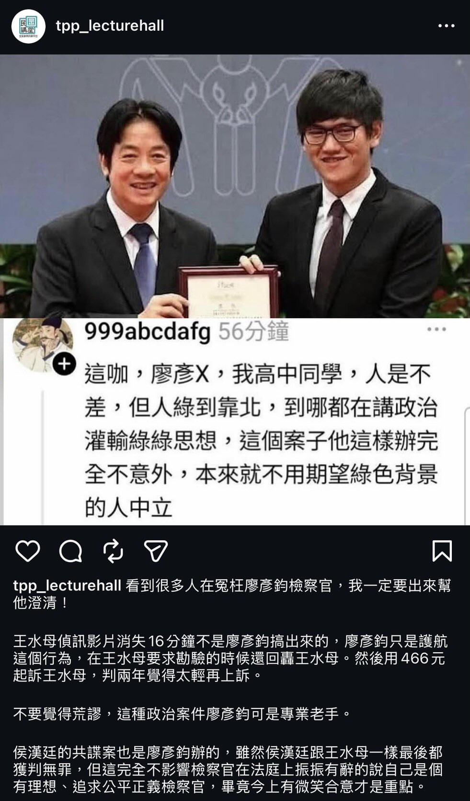

# 升官發財請走此道

> 以下整理柯文哲京華城案及相關政治案件後，參與偵辦或審判的司法人員升遷情形，以及指揮鏈上的政治任命脈絡。



---

## 一、上位指揮鏈：賴清德的司法布局

### 法務部長｜鄭銘謙

- **原職：** 臺北地方檢察署檢察長
- **現職：** 法務部長（賴清德政府首任，2024年5月就任）
- **與賴清德的關係：**
  - 台南人，與賴清德同為成大體系人脈，被外界歸類為少見的「賴系司法人馬」。
  - 2004年賴清德擔任立委時遭人毆打，當時承辦案件的檢察官即為鄭銘謙，並對施暴者求處重刑。
  - 從台南地檢署、雲林地檢署、廉政署，一路升至台北地檢署檢察長，再直接入閣擔任法務部長。
- **意涵：** 北檢作為偵辦柯文哲案的主責機關，其最高首長在案件偵辦期間即與賴清德有深厚私交，隨後獲任命為掌管全國司法的法務部長。

---

### 檢察總長｜賴清德提名徐錫祥（2026年）

- **現任總長：** 邢泰釗（蔡英文2022年提名，任期至2026年5月7日）
- **賴清德提名：** 徐錫祥（最高檢察署主任檢察官）
  - 2026年3月賴清德咨請立法院行使同意權
  - 曾任：金門、新竹、彰化、新北地檢署檢察長；法務部政務次長；**國安局副局長**
  - **爭議：** 未曾擔任台北地檢署或高等檢察署二審檢察長，以「三級跳」方式出任最高檢主任後隨即被提名總長，高檢署主任檢察官陳宏達公開批評「核心歷練不足、欠缺辦案實績」；在野黨質疑其曾任國安局副局長，政治距離過近，恐影響檢察體系中立性。

---

## 二、升遷的法官

### 許芳瑜｜柯文哲案受命法官

| 項目 | 內容 |
|------|------|
| **原職** | 臺北地方法院重大金融犯罪庭（重金庭）法官 |
| **案件角色** | 柯文哲京華城案**受命法官**（主責卷證整理、交互詰問主導、判決書撰寫）；62萬字判決書主要執筆人 |
| **升遷** | 調任**臺灣高等法院法官**（上級審，實質晉升） |
| **辦案風格** | 以嚴謹著稱，外號「小芳芳」；im.B吸金案主嫌重判16年半；偵審期間常鎖門夜戰、徹夜趕稿 |

---

## 三、升遷的檢察官

### 林俊言｜京華城案主辦檢察官

| 項目 | 內容 |
|------|------|
| **原職** | 臺北地方檢察署檢察官 |
| **案件角色** | 京華城案主力戰將，主導聲押、偵訊與論告 |
| **升遷** | 調升**新北地方檢察署主任檢察官**（公訴組） |
| **升遷時間** | 2025年7月28日法務部公告，同年8月28日生效 |
| **爭議** | 黃國昌諷刺「跟黨走，日子更紅火」；北檢票選主任僅第6名，最終仍獲法務部圈選 |

---

### 唐仲慶｜京華城案偵辦檢察官

| 項目 | 內容 |
|------|------|
| **原職** | 臺北地方檢察署檢察官 |
| **案件角色** | 參與偵辦京華城案 |
| **升遷** | 調升**花蓮地方檢察署主任檢察官** |
| **升遷時間** | 2025年7月，同批人事令 |

---

### 江貞諭｜京華城案領隊主任檢察官

| 項目 | 內容 |
|------|------|
| **原職** | 臺北地方檢察署主任檢察官 |
| **案件角色** | 領導偵辦京華城案、帶隊搜索、多次親赴羈押庭論告 |
| **升遷** | 調升**臺灣高等檢察署二審檢察官**（上位機關，實質晉升） |
| **升遷時間** | 2025年，法務部審議通過調二審名單 |
| **備註** | 柯文哲對江貞諭提出評鑑，遭駁回 |

---

### 郭建鈺｜京華城案偵辦檢察官

| 項目 | 內容 |
|------|------|
| **原職** | 臺北地方檢察署檢察官 |
| **案件角色** | 參與偵辦京華城案（訊問與金流追查） |
| **升遷** | 轉任**法官**（「檢轉法」） |
| **備註** | 檢察官轉任法官在台灣司法體系中極為罕見，難度極高，視為重大晉升 |

---

### 朱家蓉｜罷免不實連署案主辦檢察官

| 項目 | 內容 |
|------|------|
| **原職** | 臺北地方檢察署檢察官 |
| **案件角色** | 主責偵辦國民黨「罷雙吳」不實連署案（吳思瑤、吳沛憶），聲押北市黨部前主委黃呂錦茹獲准；起訴書指造假比率逾9成 |
| **升遷** | 調升**臺北地方檢察署主任檢察官** |
| **升遷時間** | 2025年7月，同批人事令 |
| **備註** | 與林俊言同一批升官，被在野黨統稱為「辦柯文哲的升官、辦大罷免的也升官」 |

---

## 四、升遷彙整表

| 姓名 | 職別 | 原職 | 升遷後職務 | 相關案件 |
|------|------|------|-----------|---------|
| 鄭銘謙 | 檢察官→部長 | 台北地檢署檢察長 | **法務部長** | 賴清德政府布局 |
| 徐錫祥 | 檢察官→總長（提名中） | 最高檢主任檢察官 | **檢察總長**（被提名） | 賴清德2026年提名 |
| 許芳瑜 | 法官 | 北院重金庭法官 | **高等法院法官** | 柯文哲案受命法官 |
| 江貞諭 | 主任檢察官 | 北檢主任 | **高檢署二審檢察官** | 領隊偵辦京華城案 |
| 林俊言 | 檢察官 | 北檢檢察官 | **新北地檢主任**（公訴組） | 京華城案主辦 |
| 唐仲慶 | 檢察官 | 北檢檢察官 | **花蓮地檢主任** | 京華城案偵辦 |
| 郭建鈺 | 檢察官 | 北檢檢察官 | **法官**（檢轉法） | 京華城案金流 |
| 朱家蓉 | 檢察官 | 北檢檢察官 | **北院地檢主任** | 罷免不實連署案 |

---

## 五、明升暗降：不配合辦案的代價

### 林邦樑｜北檢檢察長→最高檢察署檢察官

| 項目 | 內容 |
|------|------|
| **原職** | 臺北地方檢察署**檢察長**（「天下第一檢」掌舵人） |
| **去職原因** | 偵辦**高虹安助理費詐領案**時「配合度不高」，承辦檢察官曾因不獲支持而爆氣、與主任大吵 |
| **表面去向** | 調升**最高檢察署檢察官**（名義升格） |
| **實質評價** | 外界普遍認定為「**明升暗降**」——失去全國最具實權檢察長職位，調往無實際偵辦職能的最高檢 |
| **時間** | 2023年4月公告，任期未滿2年即去職 |
| **接任者** | **鄭銘謙**（從金門高分院檢察長調來接任北檢檢察長） |

**後續劇本：**  
鄭銘謙接任北檢檢察長後隨即拍板起訴高虹安，完成林邦樑任內未能推進的案件，數月後被賴清德政府拔擢為**法務部長**。一貶一升，形成鮮明對比。

> 高虹安案一審判刑7年4個月，但二審2025年12月**翻案**，改依偽造文書罪判刑6個月、得易科罰金18萬元——最終結果顯示一審重判遭推翻，使「配合辦案」的代價更加諷刺。

---

### 附記：不辦柯案的降職

目前尚未有公開報導具體記載因「拒絕辦理柯文哲案」而遭降調的司法人員個案。然而結構性觀察如下：

- 高虹安案前例顯示，北檢檢察長若辦案「配合度不高」，任期不滿即遭去職。
- 法務部2024年多次人事調整的時間節點，與案件偵查進度高度吻合。
- 柯文哲案「誰因不配合而被邊緣化」在現有公開資料中尚無具體個案可查，有待二審過程中進一步揭露。

> 若有讀者掌握具體降調個案，歡迎補充。

---

## 六、廖彥鈞｜未升官，但爭議多

廖彥鈞為臺北地方檢察署檢察官，未列入本輪升遷名單，但在多起政治敏感案件中留下爭議紀錄。





### 爭議一：彭振聲補充理由書——彭夫人跳樓

廖彥鈞與北檢同僚**陳思荔**，是令彭振聲妻子「倍感壓力到想不開」那份**補充理由書的主筆**。

該份補充理由書（刑18）內容提及：彭振聲妻子感受極大壓力，「所以妳煩惱到7/1，從台北坐第一班高鐵回到高雄，從13樓跳下去，結束生命」——以彭夫人的絕望話語直接入書狀。

補充理由書提出後，彭振聲在庭上被詰問，妻子的輕生嘗試成為施壓工具。法院最終不採認當天筆錄，但採納了此後彭振聲在持續壓力下所做的認罪供詞（詳見「法院不採信辯方爭點」二十一節）。

### 爭議二：侯漢廷「共諜案」主辦

廖彥鈞亦為偵辦**侯漢廷共諜案**的主辦檢察官。侯漢廷為國民黨籍政治人物，該案被輿論廣泛質疑為政治迫害，與其在罷免期間的高調反綠立場直接相關。

### 爭議三：護航高虹安案消失的16分鐘

高虹安案中水母指稱盧慧珊檢察官關掉攝影機並威脅說
對，我知道你很無辜，但你跟高虹安沾上一點邊
對，我起訴書寫好了，你認罪就緩刑
這是上面的意思，上面就是一定要起訴高宏安，一定要一起訴助理
認罪就給妳緩刑，不認罪就起訴妳七年起跳!

廖彥鈞在法庭上護航盧檢：
廖彥鈞表示，當天偵訊王郁文時，因為委任律師多次和王郁文溝通，因此偵訊才中斷，沒有特殊原因。


---

---

## 七、賴清德如何指揮判決？指揮鏈說明

很多人問：民主國家法官不是獨立審判嗎？

指揮鏈如下：

```
賴清德（總統）
  ↓ 任命
法務部長（鄭銘謙，賴清德的好麻吉）
  ↓ 任命
檢察總長（徐錫祥，賴清德2026提名）
  ↓ 指揮
北檢（起訴、聲押、論告）
```

法官「獨立審判」是說好聽的。壓力有多種形式：

- **紀凱峰案**：法官被施壓迴避，扛下壓力後重判，隨即辭職。
- **鄭文燦案**：鄭文燦案的承審法官，已輪了**第三個**，前兩個不是裝病就是退休。
- **柯文哲羈押**：承審法官說「尊重審級制度」，卻讓檢察官**無限抗告**，使柯文哲在**沒有金流直接證據**的情況下羈押**一年**，交保金7,000萬仍遭羈押。

> 如果法官真的可以獨立審案，為什麼會被檢察官這樣弄？

---

## 八、民進黨秘書長喬檢調人事

民進黨秘書長林錫耀涉嫌介入檢察官人事安排，相關人事網絡如下：

| 姓名 | 身份 |
|------|------|
| 蔡清祥 | 前法務部長 |
| 陳俊麟 | 國安會副秘書長、資策會董事 |
| 林錫耀 | 民進黨秘書長 |

資料來源：[@kp_supporter_keepgoing](https://www.threads.com/@kp_supporter_keepgoing/post/DMbxvPtPYzD)

---

*本文件依據公開報導整理，相關升遷係依法務部及司法院人事公告，各方評論不代表本文件立場。*
