# 無良媒體造謠存證區
卡提諾整理：
https://youtu.be/h_dDuXb6rps?si=4jiczTfY1jB2HQnn

## 鏡新聞
### 20240911 ATM存619萬
https://www.ettoday.net/news/20240911/2814696.htm?from=fb_et_news_comment&fbclid=IwZXh0bgNhZW0CMTEAAR3AnTs1BpJg4dGZe2djGsY2bzKp5Gu24b20oEJraW5Rhvu8OvgLjzf-iJc_aem_6tgb-mcD16Qkjl45HWd9IA

黃瓊慧造謠

### 20240910 下條子
https://www.mirrormedia.mg/story/20240907inv006

### 20240910 1500
https://www.mirrormedia.mg/story/20240907inv007?utm_source=mmweb&utm_medium=editorchoice

 [source](https://www.facebook.com/share/9up3bCdirhocXYJ5/?mibextid=CTbP7E)
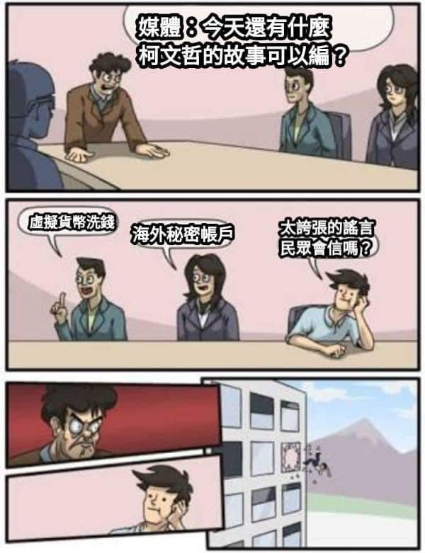

### 20240918 小額捐款變為賄款

https://www.setn.com/m/news.aspx?newsid=1531526&utm_source=linetoday&utm_medium=rss&utm_campaign=1531526&_trms=61c43c73ce56cbee.1726620703890

### 20240918 假民調
TVBS新聞

記者 潘袁詩羽

民調／60.1%挺法院羈押柯文哲　近8成不贊同小草包圍院檢

民眾黨主席柯文哲日前因涉圖利京華城案遭羈押禁見，民眾黨並啟動全台宣講活動，訴諸
司法迫害；網紅「館長」陳之漢更多次於網路號召小草包圍台北地院與北檢。根據《鏡新
聞》最新民調，有60.1%民眾贊同法院裁定羈押柯文哲、26.7%不贊同；而僅有14.4%表達
贊同包圍法院和地檢署，更多達78.2%的民眾表示不贊同該行為。此外，62%民眾認為柯故
意圖利京華城、56.2%認為柯有貪污收賄。

柯文哲遭羈押禁見　60.1%贊同法院裁定 、26.7%不贊同

民眾黨主席、前台北市長柯文哲因京華城案，被法院羈押禁見，有六成以上60.1%的民眾
贊同法院羈押禁見的裁定（28.1%非常贊同、32.0%還算贊同）；26.7%不贊同法院裁定羈
押禁見（14.9%不太贊同、11.8%非常不贊同），13.3%未表態。

不滿柯羈押禁見網路號召嗆包圍院檢　78.2%不贊同、僅14.4%贊同

對於有民眾不滿法院裁定羈押禁見，在網路號召要包圍法院和地檢署，78.2%的民眾表示
不贊同（31.8%不太贊同、46.4%非常不贊同），僅14.4%表達贊同包圍法院和地檢署（
4.3%非常贊同、10.1%還算贊同）。

柯說今年三四月才知京華城容積率840%? 75.1%不信他!

而柯文哲在羈押禁見前曾表示，直到今年三四月才知道京華城容積率高達840%，有高達
75.1%民眾不相信柯文哲的說法（31.2%不太相信、43.9%非常不相信），只有15%民眾相信
柯文哲的說法（3.9%非常相信、11.1%還算相信），9.8%未表態。

62%民眾認為柯故意圖利京華城　56.2%認為柯有貪污收賄

究竟柯文哲在京華城改建案上，有沒有故意圖利廠商？62%民眾認為有圖利之嫌（30.1%一
定有、31.9%可能有），23.8%民眾認為沒有圖利（18.2%可能沒有、5.6%一定沒有），
14.2%未表態。同時，對於柯文哲在京華改建案，有沒有貪污收賄？56.2%民眾認為有貪污
收賄（24.9%一定有、31.3%可能有），28%民眾認為沒有貪污收賄（19.0%可能沒有、9.0%
一定沒有），15.8%未表態。

交叉分析顯示，民眾黨支持者中，有58.4%不贊成包圍院檢，同時也有45.3%的民眾黨支持
者不相信柯文哲今年三四月才知道京華城容積率840%的說法。不過，民眾黨支持者有7成
以上不贊同法院裁定柯文哲羈押禁見、認為阿北沒有圖利、沒有貪污收賄。

本調查由《鏡新聞》規劃，並委託大地民意研究公司協助問卷設計與執行調查。自2024年
9月14日至9月16日，調查戶籍於台閩地區且年滿20歲以上的民眾。有效樣本：市話543人
、手機544人，共1087份，在95%信心水準下抽樣誤差正負2.97%。調查抽樣方法採用市話
及手機雙底冊訪問，市話採用縣市電話比例進行分層抽樣抽出號碼，手機使用後五碼隨機
抽樣抽出號碼。加權方式依內政部最新人口資料，針對戶籍地行政區、性別、教育程度及
年齡採用多重反覆加權(Raking)。母體資料來源為數位發展部政府資料開放平台
https://data.gov.tw/，經費來源為鏡電視。

https://news.tvbs.com.tw/politics/2621957

### 20240924 掌握金流
https://www.mirrormedia.mg/story/amp/20240924inv002
### 20241217 混在一起做撒尿牛丸
【四大罪將起訴柯】柯文哲不只收沈慶京1710萬賄款　爆「屯田計畫」想再撈20億

https://www.mirrormedia.mg/story/20241214inv002

【四大罪將起訴柯1】不法金額逾8千萬　一張表秒懂柯文哲4大罪狀

https://www.mirrormedia.mg/story/20241214inv003

【四大罪將起訴柯2】認不認罪下場差很大　柯文哲想獲輕判只剩一條路

https://www.mirrormedia.mg/story/20241214inv004

【四大罪將起訴柯3】命大帳房請益「阿扁的劉泰英」　柯文哲走國民黨老路原因曝光

https://www.mirrormedia.mg/story/20241214inv005

【四大罪將起訴柯4】割小草韭菜還不夠　柯文哲「黨營事業」藍圖曝光

https://www.mirrormedia.mg/story/20241214inv006

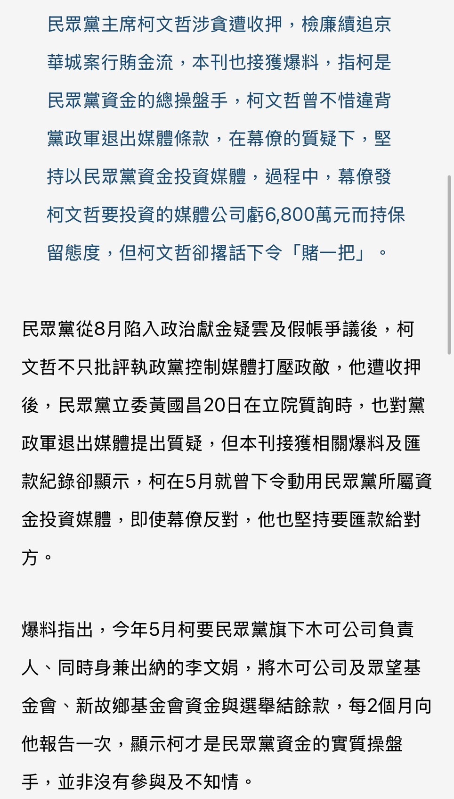
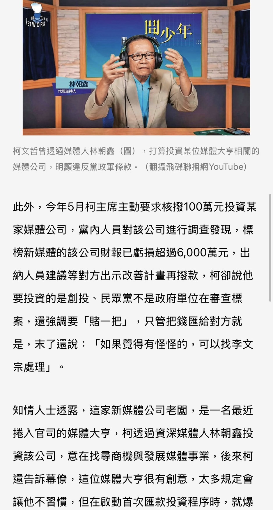

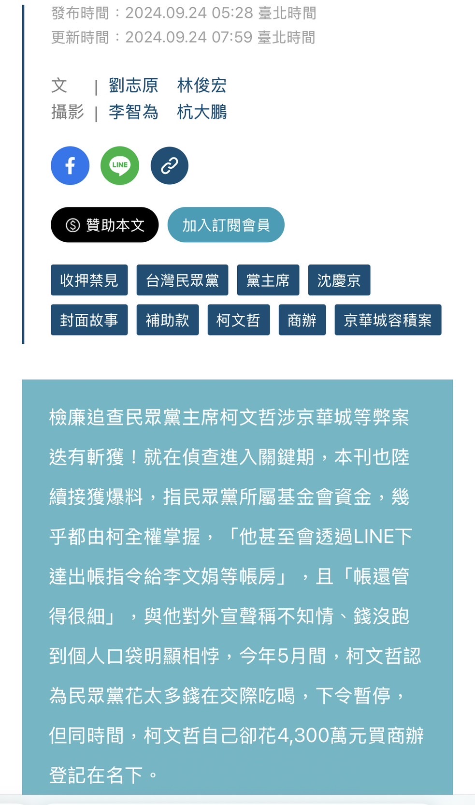
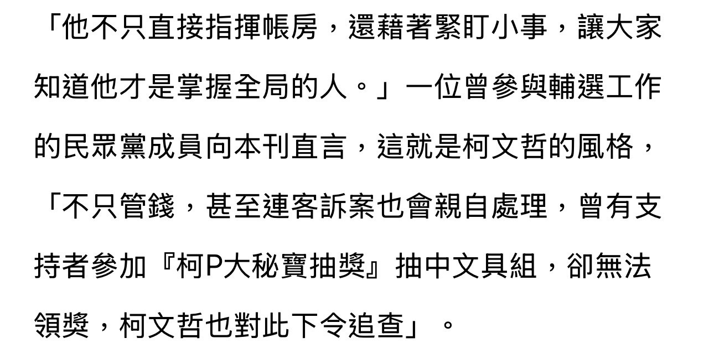
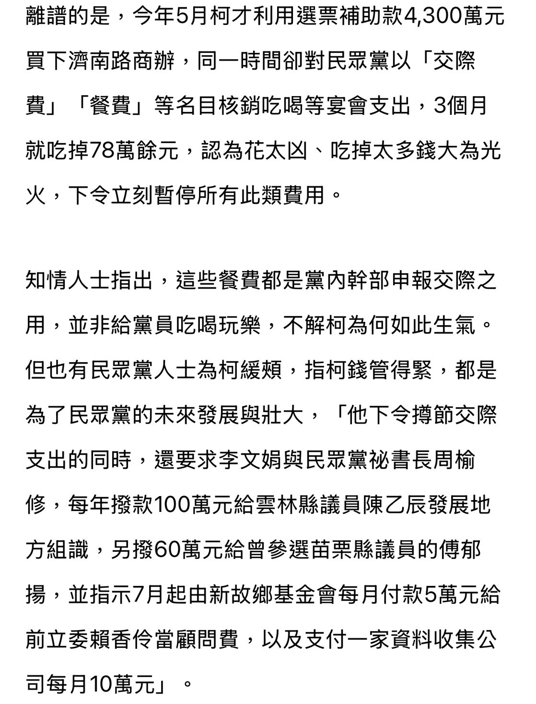

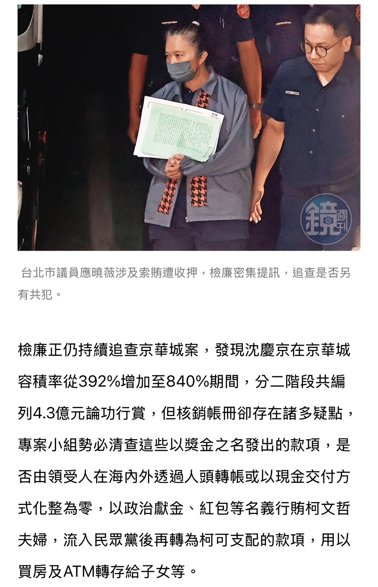

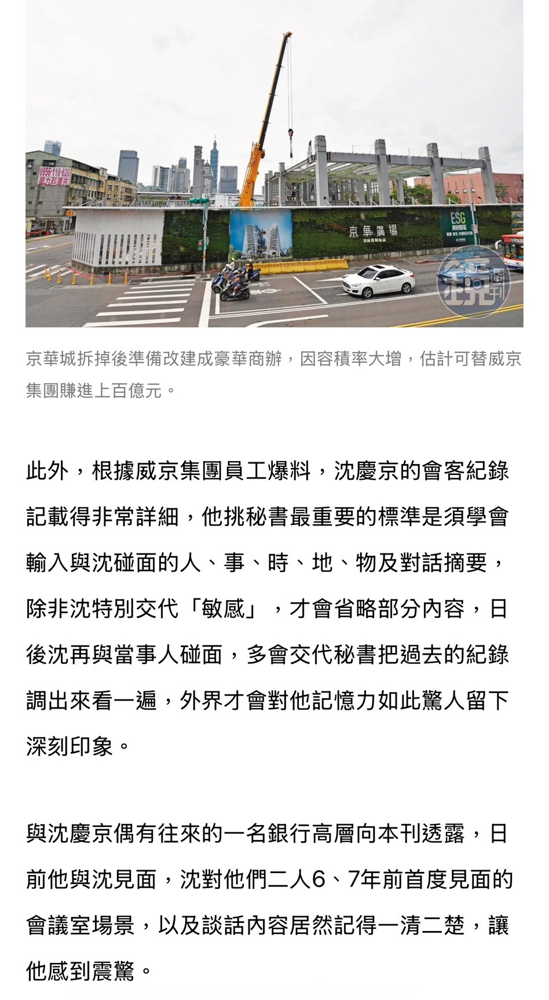

### 20241008 貼身帳房橘子
https://www.mirrormedia.mg/story/20241003inv004

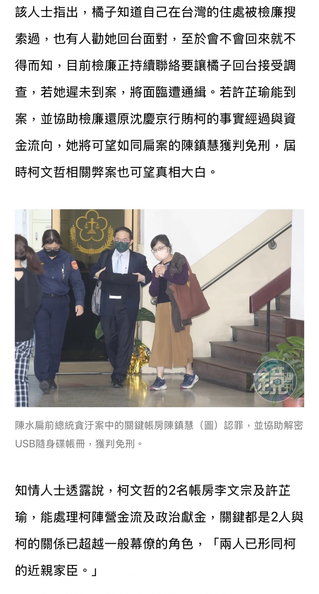
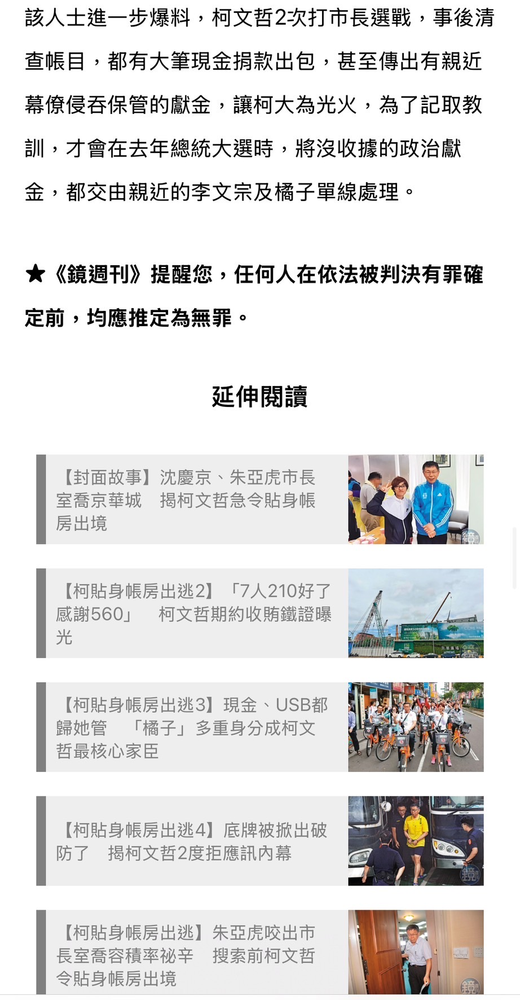

【柯獄中生活解密】看電視、頻稱病、念佛經　京華城案3要角獄中生活曝光　

https://www.mirrormedia.mg/story/20241130inv003

【柯獄中生活解密1】關鍵案情不漏接　柯文哲獄中掌握輿情只花3500

https://www.mirrormedia.mg/story/20241130inv004

【柯獄中生活解密2】沒住忠3舍名人套房　柯文哲改住「保護舍」原因曝光

https://www.mirrormedia.mg/story/20241130inv005

【柯獄中生活解密3】自曝夢見「紅袍道長來看我」　應曉薇提訊過程突下跪

https://www.mirrormedia.mg/story/20241130inv006

【柯獄中生活解密4】送柯文哲名畫下落不明　再爆沈慶京3行徑被笑「賭豬」

https://www.mirrormedia.mg/story/20241130inv007

【柯獄中生活解密5】遭檢舉當佛學會門神　應曉薇拿錢辦事再惹議

https://www.mirrormedia.mg/story/20241130inv008
## 民視
### 20240910 冒充前黨工
 [source](https://www.facebook.com/share/p/FbxnPNBthaXEnQKK/?mibextid=CTbP7E)

《民視新聞》獨家報導，USB 內的 Excel 檔案證實柯收威京集團 1,500 萬，檔案來源是綠桃園議員「于北辰」軍中下屬。

于北辰指出，吹哨者為民眾黨終身黨員「張殿臣」(附上終身黨證照片)，過往幫民眾黨「磁碟重整」時獲得此份資料，希望檢調嚴查。

民視獨家報導上架後，眼尖網友卻發現，這張終身黨證擁有者實際上是「張殿昀」，曾在 YouTube 發過黨證開箱影片。

台灣時間 9/11 凌晨，「張殿昀」拍影片回應：

- 那張被盜用的黨證照片是我的，我人在加拿大，最近都在打《黑神話：悟空》，根本沒在關注台灣時事。

- 以前很欣賞于北辰將軍，後來覺得他這個人怪怪的。

- 希望媒體報導前，至少可以先查證。

隨後，民視新聞凌晨緊急下架該新聞片段。[source](https://www.facebook.com/share/PCsjdKn8kELbChGW/?mibextid=CTbP7E)

不禮貌整理脈絡：
https://youtu.be/Ukv_uB_d1F0?si=1a495Q0qBT0_IFT-

于北辰縮了

https://www.ptt.cc/bbs/Gossiping/M.1726023773.A.293.html

北檢不予證實

### 20240918 1500蟑螂
民視新聞網

2.記者署名:

即時中心／詹詠淇報導

3.完整新聞標題:

快新聞／柯文哲網軍費從哪裡來？　吳靜怡：你這1500柯蟑螂！有夠噁心

4.完整新聞內文:

民眾黨主席柯文哲因京華城案遭收押，檢廉單位擴大追查涉及京華城容積率暴增的官員及
柯家相關金流。對此，政治評論員吳靜怡今（18）日表示，柯文哲1.5億金流從何而來？
該不會就是柯文哲化整為零的「金子力學」？這些詭異的金流競選總幹事是渾然不知還是
知法玩法？問問柯文哲，大選期間至今，網軍費用從哪裡來？當然，就是一堆一堆不明金
流付出去的吧！「你這1500柯蟑螂，有夠噁心」。

吳靜怡在臉書表示，柯文哲和競總幹部隱匿實情，算不算集體式的犯罪？柯文哲競選總部
曾經和木可公關公司有著一份合約，依據合約內容，1.5億元乘以10％，就是巧立名目的
「授權金」1500萬元。

吳靜怡質疑，這1.5億的金流來源是純粹的競選小物抖內金額嗎？從競選小物的成本數額
來看，也是對不上的。該不會就是柯文哲化整為零的「金子力學」？

「另外，這些詭異的金流，競選總幹事是渾然不知情，還是知法玩法？」吳靜怡說，其實
，錯誤不有李文宗財務長一個人，真相，會不會柯文哲就是所有金援和金錢分配的操盤手
？

吳靜怡指出，從柯文哲競選總部政治獻金案到京華城弊案，柯團隊恐怕最慶幸的就是跳過
競總的問題，但問題還是問題，「你們依然沒有好好解釋」，連YouTube的KPTV頻道抖內
收益1個月後，都沒辦法拿出後台截圖，大家心裡都有底了。

吳靜怡提及，網軍一直攻擊，只要關鍵字有「馬郁雯」就會撲上去，抖音、threads、Lin
e瘋狂散佈影射她大頭症的影片，這些行為頂多影響個人，但無法拯救民眾黨和柯文哲，
「現在可悲的柯文哲也只能靠網紅、網軍耍耍樣子，有夠蠢」。

最後，吳靜怡說，問問柯文哲，從大選期間至今，這些網軍費用從哪裡來？當然，就是一
堆一堆不明金流付出去的吧！「你這1500柯蟑螂，有夠噁心」。

5.完整新聞連結 (或短網址)不可用YAHOO、LINE、MSN等轉載媒體:

https://reurl.cc/WN8N9x民視新聞網

2.記者署名:

即時中心／詹詠淇報導

3.完整新聞標題:

快新聞／柯文哲網軍費從哪裡來？　吳靜怡：你這1500柯蟑螂！有夠噁心

4.完整新聞內文:

民眾黨主席柯文哲因京華城案遭收押，檢廉單位擴大追查涉及京華城容積率暴增的官員及
柯家相關金流。對此，政治評論員吳靜怡今（18）日表示，柯文哲1.5億金流從何而來？
該不會就是柯文哲化整為零的「金子力學」？這些詭異的金流競選總幹事是渾然不知還是
知法玩法？問問柯文哲，大選期間至今，網軍費用從哪裡來？當然，就是一堆一堆不明金
流付出去的吧！「你這1500柯蟑螂，有夠噁心」。

吳靜怡在臉書表示，柯文哲和競總幹部隱匿實情，算不算集體式的犯罪？柯文哲競選總部
曾經和木可公關公司有著一份合約，依據合約內容，1.5億元乘以10％，就是巧立名目的
「授權金」1500萬元。

吳靜怡質疑，這1.5億的金流來源是純粹的競選小物抖內金額嗎？從競選小物的成本數額
來看，也是對不上的。該不會就是柯文哲化整為零的「金子力學」？

「另外，這些詭異的金流，競選總幹事是渾然不知情，還是知法玩法？」吳靜怡說，其實
，錯誤不有李文宗財務長一個人，真相，會不會柯文哲就是所有金援和金錢分配的操盤手
？

吳靜怡指出，從柯文哲競選總部政治獻金案到京華城弊案，柯團隊恐怕最慶幸的就是跳過
競總的問題，但問題還是問題，「你們依然沒有好好解釋」，連YouTube的KPTV頻道抖內
收益1個月後，都沒辦法拿出後台截圖，大家心裡都有底了。

吳靜怡提及，網軍一直攻擊，只要關鍵字有「馬郁雯」就會撲上去，抖音、threads、Lin
e瘋狂散佈影射她大頭症的影片，這些行為頂多影響個人，但無法拯救民眾黨和柯文哲，
「現在可悲的柯文哲也只能靠網紅、網軍耍耍樣子，有夠蠢」。

最後，吳靜怡說，問問柯文哲，從大選期間至今，這些網軍費用從哪裡來？當然，就是一
堆一堆不明金流付出去的吧！「你這1500柯蟑螂，有夠噁心」。

5.完整新聞連結 (或短網址)不可用YAHOO、LINE、MSN等轉載媒體:

https://reurl.cc/WN8N9x
## 三立
### 20240908 馬郁雯經營檢調這條線七年
這其實是超級大醜聞欸

https://www.ptt.cc/bbs/Gossiping/M.1725793364.A.68F.html

https://i.imgur.com/ZkuYDgx.jpeg

如圖
檢調單位裡面居然會有媒體安插七年的內線
七年是什麼概念
不就是蔡前總統上任不久嗎
剛上任司法體系就被媒體滲入
這是國家級大事吧

司法體系是不是要崩潰了
能被一位記者這麼容易的派線人入侵長達七年
這七年裡面有沒有重大犯人透過這位媒體提前知道消息而逃之夭夭
細思極恐

檢調被輕輕鬆鬆經營7年的內線
有沒有掛

更 附上連結
https://youtu.be/FyI2j2AF4FI?si=G8ek-Vo_dqnuA2tf&t=218

### 20240914 20%其實合法
https://www.setn.com/News.aspx?NewsID=1530078
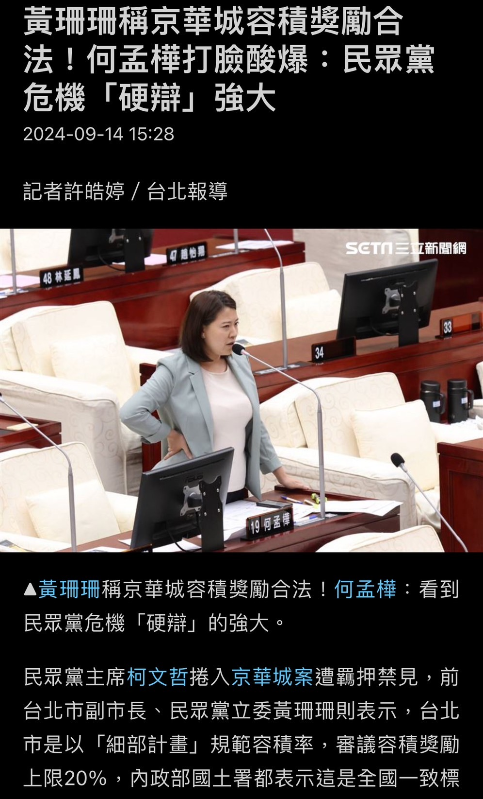
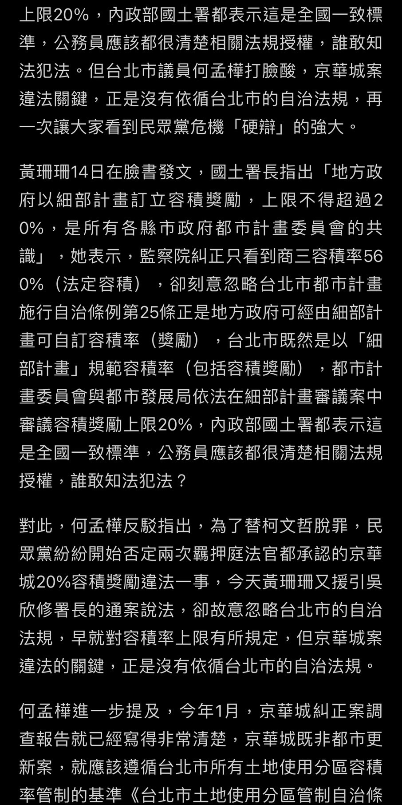
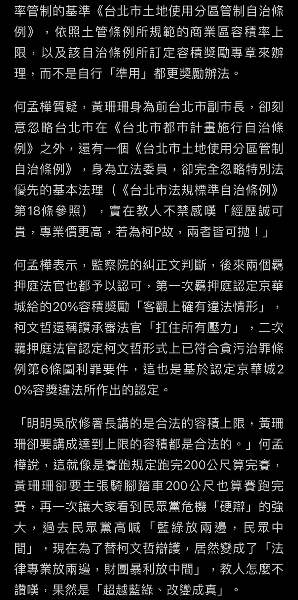

三立

獨家／柯買商辦30秒內3筆轉帳　仲介費+簽約款間藏神秘152萬
2024-09-14 19:06

政治中心／程正邦報導

王義川爆料，柯文哲買商辦的兩筆錢，中間多了一筆152萬沒交代。 (圖／翻攝54陪審團)

前台北市長柯文哲捲京華城弊案遭收押，妻子陳佩琪多次利用ATM存提款大筆金額，遭北檢
約談。雖然陳佩琪公布帳戶明細，強調他們家的錢都是「正當清白的錢」。不過民眾黨政策
會執行長王義川發現，柯文哲帳戶有3筆匯款在30秒內完成，新竹市議員李國璋還匯了23萬
元給柯文哲，「如果是處理黨務，為何要匯到柯的私人帳戶」，質疑不單純。

陳佩琪日前接受媒體專訪，說明5大筆金流約1628萬元，試圖證明柯文哲買商辦是用總統選
舉的補助款；至於6年用ATM轉帳60次，單純是她認為臨櫃轉帳太麻煩；而爭議保險箱的百萬
元現金，則是給子女的應急款。

不過王義川今天（14日）在三立政論節目《54陪審團》，拿出柯文哲買商辦銀行明細質疑，
「有3筆錢通通在30秒內完成」。他推測能這麼快轉帳有幾種可能，一種是用手機APP，第二
種是去銀行櫃檯拿匯款三聯單給行員key-in。

但啟人疑竇的是，40萬仲介費跟420萬買房簽約款，中間插了152萬，「保約專戶這裡頭並沒
有152萬，也就是他在處理兩大筆錢的中間，插了一筆跟房子無關的錢」，認為陳佩琪公布
的金流仍存在疑點，需要解釋。

另外，柯文哲銀行明細中還出現了民眾黨新竹市議員李國璋的名字，他在5月21日早上9時許
，匯了235875元給柯文哲，王義川質疑，「李國璋是民眾黨的黨員，匯了23萬多給民眾黨的
黨主席，這是什麼狀況？」

王義川說，如果是跟黨主席借錢然後還錢，但金額還有個位數，不太合理；「如果是黨務，
因為李國璋是新竹市黨部主委，這筆錢應該去進民眾黨的黨中央，也不會進到柯文哲(私人
帳)。」

王義川分析第三種可能，去年底總統大選期間，柯文哲被爆料說好要種芭樂的農地改成停車
場，向遊覽車業者收租。王義川說新竹那塊地，都是李國璋在幫柯文哲處理的。「會不會是
李國璋幫柯文哲私人在新竹處理什麼業務，可能是租金？還是什麼金？才會必須匯23萬包括
到個位數的錢給柯文哲。」

民眾黨發言人戴于文表示，針對爆料，還是要看證據的狀況，不然也不會隨之起舞的回應。

https://www.setn.com/m/news.aspx?newsid=1530158

### 20240915 比特幣1500枚29億
震撼！

剛剛敏鳳在三立政論節目說

不是1500萬，而是1500顆比特幣

哇塞！  這樣就對起來了，難怪金流這麼抓！

剛算一下，1500顆比特幣約台幣29億

有沒有1500顆比特幣，要挖礦挖多久的卦？

### 20241006 外遇是⋯？
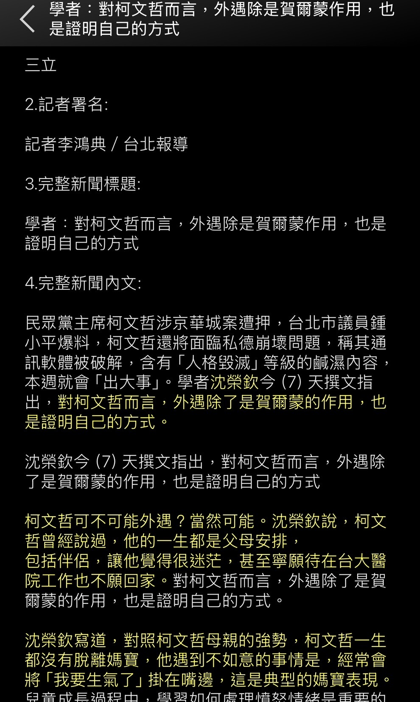

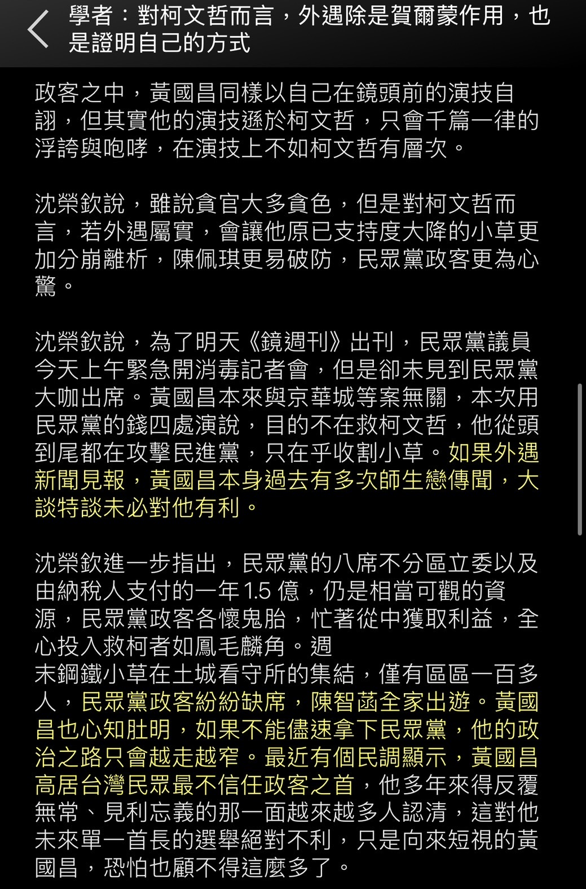

## 東森

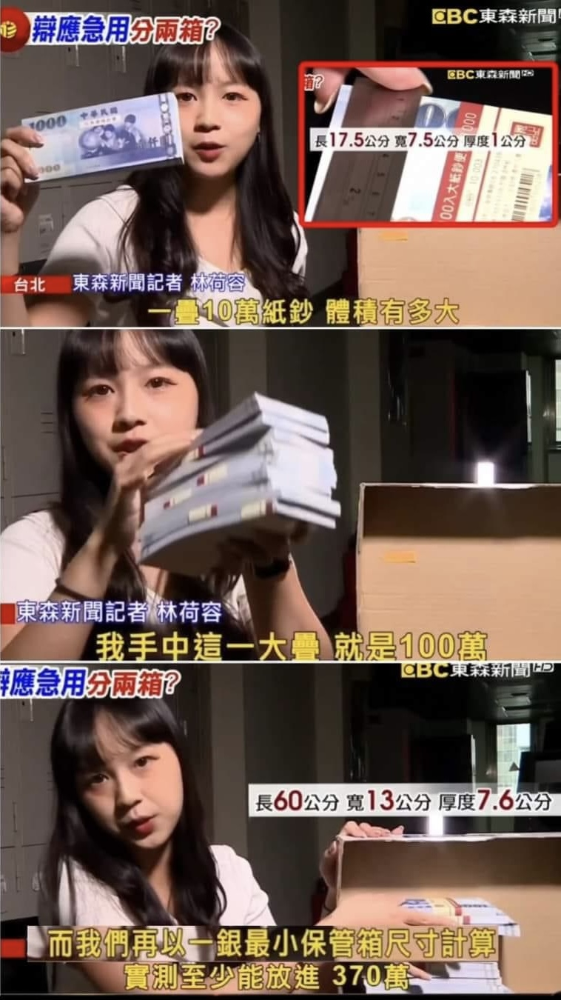

[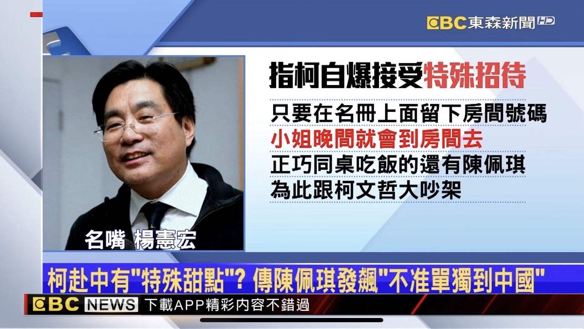

](https://)

## 劉寶傑造謠洗腦
https://youtube.com/shorts/P_ue__Q1lF0?si=FzODZ--qA6E_szQ1

## 其他

（優文分享）

政黑翻車時常有

但我第一次看到一天翻五頁的

1、光頭200

柯文哲光頭200 ！
北市府老同事就應該整整齊齊！！
https://i.imgur.com/T0U0a8b.jpeg

揭曉：跟柯文哲無關

政黑：翻頁！！

2、柯文哲偵辦過程

1500稱改時間 沈說全忘了

https://i.imgur.com/K2Fkhm5.jpeg

檢方聲明：非事實

政黑：翻頁！！

3、柯文哲冷錢包

保險箱搜到冷錢包

檢方聲明：非事實

政黑：翻頁！！

4、PG文件露出柯文哲選後新開戶頭

為什麼有新分行名字？

柯文哲選後刻意多開兩戶頭
https://i.imgur.com/8K4k8CD.jpeg

結果又被打臉

銀行名稱只是PG去申請明細的分行

政黑：翻頁！！

5、怎麼是登記在PG名下？？

PG又露餡了！！ 屋主是PG！！！
https://i.imgur.com/1zMeCli.jpeg

不是…那個是代處理 買的叫PG

房屋登記在身分證J開頭的的柯xx名下

這當初謄本不就看過了

政黑：翻頁！！

神X病集中營嗎？現在XDDD

一天翻5頁XDDD

來源：[討論] 政黑好猛歐 一天翻五頁
https://moptt.tw/p/HatePolitics.M.1726243899.A.14D

= = = = = =
從冷錢包玩到保險箱
側翼問幹嘛不看新聞
靠北長這樣子
幹嘛還看新聞

# 檢舉管道
幫大家抄重點

1)公務員罪行：法務部調查局線上檢舉
https://www.mjib.gov.tw/Poll?Module=2 
或打0800 007 007

2)檢舉假訊息：email 到 service@mjib.gov.tw 信箱，敘明案情，並附加「截圖」檔案

3)申訴有線電視媒體:NCC申訴電話0800201205(記得用另一支手機錄音錄影存證)

4)地檢按鈴申告：有確切事項及證據

5)寄一哥的信箱 betruthteller666@gmail.com
6)檢舉電話示範從9:09分開始

🔥法務部調查局
ex：北檢違反偵察不公開
． 0800-007-007
． service@mjib.gov.tw

🔥NCC國家通訊傳播委員會
ex：三立、鏡週刊、菱傳媒
．0800-177177#3
．針對有線電視申訴網址：
https://cabletvweb.ncc.gov.tw/pop30

🔥三立電視客服檢舉
． 87928888@mail.sanlih.com.tw
．02-8792-8888

🔥鏡周刊客服檢舉
． 02-66333966
． onlineservice@mirrormedia.mg

🔥高檢署檢察長信箱
https://www.tph.moj.gov.tw/4707/197095/

🔥宜蘭地檢
． ilcn@mail.moj. gov.tw
．03-9253133 或
．03-9253000轉232

🔥新北地檢署
． 02-22624063

🔥台中地檢署
． 0800-286-586

🔥嘉義地檢署
．05-2752548 或
．0800-024-099轉4

🔥台南地檢署
．0800-024099 
．新營電話：06-6324230

🔥高雄地檢署
．0800024099撥通後按4

🔥屏東地檢署
．0800-286-586

🔥花蓮地檢署
．03-8230159

#資料來源邏輯ㄧ哥